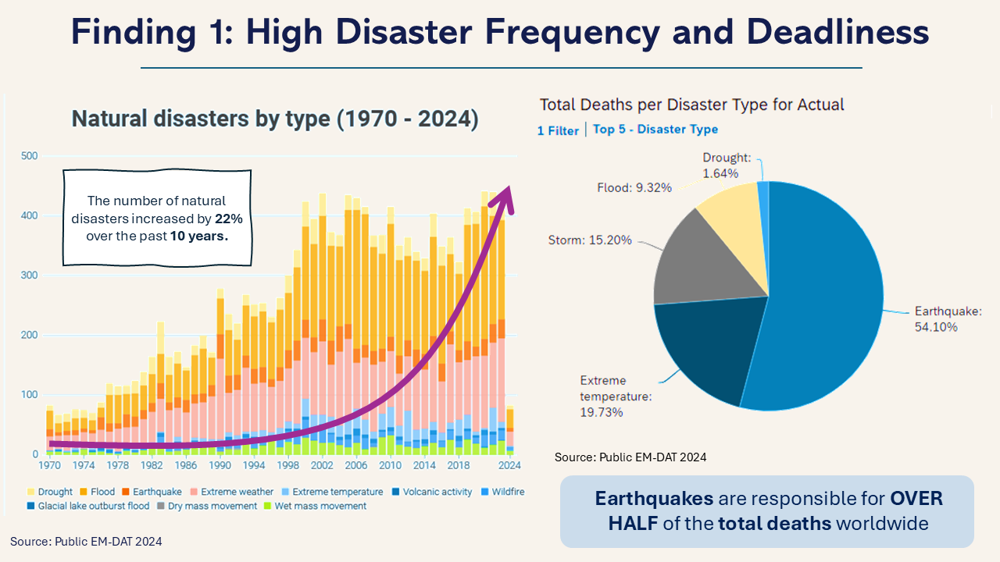

# Safe Buddy - Disaster Analytics Platform (ASEAN DSE 2025)

🏆 2nd Runner-Up – ASEAN Data Science Explorers 2025 (Myanmar National Finals)

---

## 📌 Project Overview
SafeBuddy is a data-driven disaster preparedness platform designed to support vulnerable communities across ASEAN. The solution focuses on improving accessibility, early warning systems, and community resilience using data analytics and digital innovation.

---

## 🌏 Problem Statement
- Natural disasters in ASEAN have increased significantly in recent years  
- Economic losses exceeded **$2.9 trillion (2000–2023)**  
- Rural and coastal populations remain highly vulnerable  
- Limited access to real-time alerts and disaster resources  

---

## 📊 Data Sources
- EM-DAT (International Disaster Database)  
- ASEAN disaster and risk reports  
- Statista datasets  
- ESCAP & UNDP reports  

## 📊 Dashboard Preview

---

## 🔍 Key Insights
- 📈 **22% increase in natural disasters** over the past decade  
- 💸 Rising global economic losses from disasters  
- ⚠️ Myanmar and the Philippines face the highest disaster risks in ASEAN  
- 🌊 Floods are the most common climate-related threat  

---

## 💡 Solution – SafeBuddy
A **mobile-first, offline-capable disaster safety platform** that provides:

- 🚨 Real-time alerts (even with limited connectivity)  
- 🌐 Multilingual support for ASEAN communities  
- 📱 Emergency guides and key hotlines  
- ♿ Accessibility for elderly and vulnerable populations  

---

## 🛠 Tools & Technologies
- SAP Analytics Cloud (SAC)  
- Data Analysis & Visualization  
- Data Storytelling Techniques  

---

## 📈 Impact & KPIs
- Improve disaster response accessibility  
- Increase alert delivery success rates  
- Scalable across ASEAN disaster-prone regions  
- Supports **UN Sustainable Development Goal 11 (Sustainable Cities & Communities)**  

---

## 📂 Project Files
- 📊 [Presentation Slides](MYANMAR_TEAM-NEBULA-BEANS.pptx)

---

## 🤝 Team
- Khin Chan Thar  
- Naw May Thu Han  
